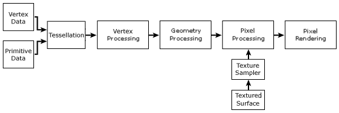
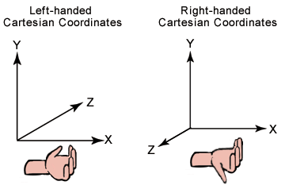
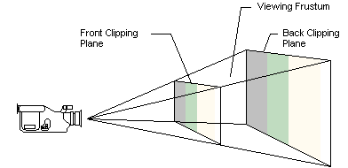
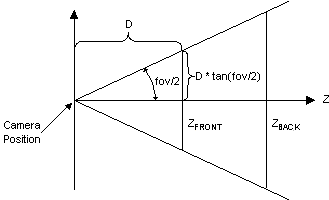

# Direct3D9 demo

# 环境搭建
先去下载[DirectX Software Development Kit](https://www.microsoft.com/en-us/download/confirmation.aspx?id=6812)。本文写时下载到的地址[https://download.microsoft.com/download/A/E/7/AE743F1F-632B-4809-87A9-AA1BB3458E31/DXSDK_Jun10.exe](https://download.microsoft.com/download/A/E/7/AE743F1F-632B-4809-87A9-AA1BB3458E31/DXSDK_Jun10.exe)。下载下来的文件DXSDK_Jun10.exe。

## include
include文件夹放的是Direct3D的相关头文件。是从安装DXSDK_Jun10.exe的目录的include文件夹中复制过来的。
## Lib
Lib文件夹放的是Direct3D的相关头文件。是从安装DXSDK_Jun10.exe的目录的Lib文件夹中复制过来的。

# CreateDevice Demo
该项目中主用于验证工程配置。以及运行最基本的Dirtect3D9的程序。

## HOW TO RUN
安装好cmake。进入到CreateDevice中创建build目录，然后执行cmake命令

cmake .. -G "Visual Studio 17 2022" -A Win32

然后在build中就能看到Demo.sln文件，设置Demo项目为启动项目，打开编译运行即可。
```
D:\srccode\direct3ddemo\CreateDevice\build>cmake .. -G "Visual Studio 17 2022" -A Win32
CMake Deprecation Warning at CMakeLists.txt:2 (cmake_minimum_required):
  Compatibility with CMake < 2.8.12 will be removed from a future version of
  CMake.

  Update the VERSION argument <min> value or use a ...<max> suffix to tell
  CMake that the project does not need compatibility with older versions.


-- Selecting Windows SDK version 10.0.22621.0 to target Windows 10.0.19045.
-- The C compiler identification is MSVC 19.33.31630.0
-- The CXX compiler identification is MSVC 19.33.31630.0
-- Detecting C compiler ABI info
-- Detecting C compiler ABI info - done
-- Check for working C compiler: C:/Program Files/Microsoft Visual Studio/2022/Community/VC/Tools/MSVC/14.33.31629/bin/Hostx64/x86/cl.exe - skipped
-- Detecting C compile features
-- Detecting C compile features - done
-- Detecting CXX compiler ABI info
-- Detecting CXX compiler ABI info - done
-- Check for working CXX compiler: C:/Program Files/Microsoft Visual Studio/2022/Community/VC/Tools/MSVC/14.33.31629/bin/Hostx64/x86/cl.exe - skipped
-- Detecting CXX compile features
-- Detecting CXX compile features - done
-- Configuring done
-- Generating done
-- Build files have been written to: D:/srccode/direct3ddemo/CreateDevice/build

D:\srccode\direct3ddemo\CreateDevice\build>
```

## Direct3DCreate9
[Direct3DCreate9](https://learn.microsoft.com/en-us/windows/win32/api/d3d9/nf-d3d9-direct3dcreate9)
```C++
IDirect3D9 * Direct3DCreate9(
  UINT SDKVersion
);
```
SDKVersion

Type: UINT

The value of this parameter should be D3D_SDK_VERSION.

If successful, this function returns a pointer to an IDirect3D9 interface; otherwise, a NULL pointer is returned.

The Direct3D object is the first Direct3D COM object that your graphical application needs to create and the last object that your application needs to release. Functions for enumerating and retrieving capabilities of a device are accessible through the Direct3D object. This enables applications to select devices without creating them.

Create an IDirect3D9 object as shown here:
```C++
LPDIRECT3D9 g_pD3D = NULL;
    
if( NULL == (g_pD3D = Direct3DCreate9(D3D_SDK_VERSION)))
    return E_FAIL;
```
The IDirect3D9 interface supports enumeration of active display adapters and allows the creation of [IDirect3DDevice9](https://learn.microsoft.com/en-us/windows/desktop/api/d3d9helper/nn-d3d9helper-idirect3ddevice9) objects. If the user dynamically adds adapters (either by adding devices to the desktop, or by hot-docking a laptop), those devices will not be included in the enumeration. Creating a new IDirect3D9 interface will expose the new devices.

D3D_SDK_VERSION is passed to this function to ensure that the header files against which an application is compiled match the version of the runtime DLL's that are installed on the machine. D3D_SDK_VERSION is only changed in the runtime when a header change (or other code change) would require an application to be rebuilt. If this function fails, it indicates that the header file version does not match the runtime DLL version.

## CreateDevice
[CreateDevice](https://learn.microsoft.com/en-us/windows/win32/api/d3d9/nf-d3d9-idirect3d9-createdevice). Creates a device to represent the display adapter.
```C++
HRESULT CreateDevice(
  [in]          UINT                  Adapter,
  [in]          D3DDEVTYPE            DeviceType,
  [in]          HWND                  hFocusWindow,
  [in]          DWORD                 BehaviorFlags,
  [in, out]     D3DPRESENT_PARAMETERS *pPresentationParameters,
  [out, retval] IDirect3DDevice9      **ppReturnedDeviceInterface
);
```
### [in]          UINT                  Adapter
Type: UINT

Ordinal number that denotes the display adapter. D3DADAPTER_DEFAULT is always the primary display adapter.
### [in]          D3DDEVTYPE            DeviceType
Type: D3DDEVTYPE

Member of the [D3DDEVTYPE](https://learn.microsoft.com/en-us/windows/win32/direct3d9/d3ddevtype) enumerated type that denotes the desired device type. If the desired device type is not available, the method will fail.
```C++
typedef enum D3DDEVTYPE { 
  D3DDEVTYPE_HAL          = 1,
  D3DDEVTYPE_NULLREF      = 4,
  D3DDEVTYPE_REF          = 2,
  D3DDEVTYPE_SW           = 3,
  D3DDEVTYPE_FORCE_DWORD  = 0xffffffff
} D3DDEVTYPE, *LPD3DDEVTYPE;
```
### [in]          HWND                  hFocusWindow
The focus window alerts Direct3D when an application switches from foreground mode to background mode. See Remarks.

- For full-screen mode, the window specified must be a top-level window.
- For windowed mode, this parameter may be NULL only if the hDeviceWindow member of pPresentationParameters is set to a valid, non-NULL value.

### [in]          DWORD                 BehaviorFlags

Combination of one or more options that control device creation. For more information, see [D3DCREATE](https://learn.microsoft.com/en-us/windows/desktop/direct3d9/d3dcreate).

### [in, out]     D3DPRESENT_PARAMETERS *pPresentationParameters
Pointer to a [D3DPRESENT_PARAMETERS](https://learn.microsoft.com/en-us/windows/desktop/direct3d9/d3dpresent-parameters) structure, describing the presentation parameters for the device to be created. If BehaviorFlags specifies D3DCREATE_ADAPTERGROUP_DEVICE, pPresentationParameters is an array. Regardless of the number of heads that exist, only one depth/stencil surface is automatically created.
```C++
typedef struct D3DPRESENT_PARAMETERS {
  UINT                BackBufferWidth;
  UINT                BackBufferHeight;
  D3DFORMAT           BackBufferFormat;
  UINT                BackBufferCount;
  D3DMULTISAMPLE_TYPE MultiSampleType;
  DWORD               MultiSampleQuality;
  D3DSWAPEFFECT       SwapEffect;
  HWND                hDeviceWindow;
  BOOL                Windowed;
  BOOL                EnableAutoDepthStencil;
  D3DFORMAT           AutoDepthStencilFormat;
  DWORD               Flags;
  UINT                FullScreen_RefreshRateInHz;
  UINT                PresentationInterval;
} D3DPRESENT_PARAMETERS, *LPD3DPRESENT_PARAMETERS;
```


# Direct3d9渲染管线



|Pipeline Component|Description|Related Topics|
|:--|:--|:--|
|Vertex Data|Untransformed model vertices are stored in vertex memory buffers.|[Vertex Buffers (Direct3D 9)](https://learn.microsoft.com/en-us/windows/win32/direct3d9/vertex-buffers) ,[IDirect3DVertexBuffer9](https://learn.microsoft.com/en-us/windows/win32/api/d3d9helper/nn-d3d9helper-idirect3dvertexbuffer9)|
|Primitive Data	|Geometric primitives, including points, lines, triangles, and polygons, are referenced in the vertex data with index buffers.|[Index Buffers (Direct3D 9)](https://learn.microsoft.com/en-us/windows/win32/direct3d9/index-buffers),[IDirect3DIndexBuffer9](https://learn.microsoft.com/en-us/windows/desktop/api), [Primitives](https://learn.microsoft.com/en-us/windows/win32/direct3d9/primitives), [Higher-Order Primitives (Direct3D 9)](https://learn.microsoft.com/en-us/windows/win32/direct3d9/higher-order-primitives)|
|Tessellation|The tesselator unit converts higher-order primitives, displacement maps, and mesh patches to vertex locations and stores those locations in vertex buffers.|[Tessellation (Direct3D 9)](https://learn.microsoft.com/en-us/windows/win32/direct3d9/tessellation)|
|Vertex Processing|Direct3D transformations are applied to vertices stored in the vertex buffer.|[Vertex Pipeline (Direct3D 9)](https://learn.microsoft.com/en-us/windows/win32/direct3d9/vertex-pipeline)|
|Geometry Processing|Clipping, back face culling, attribute evaluation, and rasterization are applied to the transformed vertices.|[Pixel Pipeline (Direct3D 9)](https://learn.microsoft.com/en-us/windows/win32/direct3d9/pixel-pipeline)|
|Textured Surface|Texture coordinates for Direct3D surfaces are supplied to Direct3D through the [IDirect3DTexture9](Texture coordinates for Direct3D surfaces are supplied to Direct3D through the IDirect3DTexture9 interface.) interface.|[Direct3D Textures (Direct3D 9)](https://learn.microsoft.com/en-us/windows/win32/direct3d9/direct3d-textures), [IDirect3DTexture9](https://learn.microsoft.com/en-us/windows/win32/api/d3d9helper/nn-d3d9helper-idirect3dtexture9)|
|Texture Sampler|Texture level-of-detail filtering is applied to input texture values.|[Direct3D Textures (Direct3D 9)](https://learn.microsoft.com/en-us/windows/win32/direct3d9/direct3d-textures)|
|Pixel Processing|Pixel shader operations use geometry data to modify input vertex and texture data, yielding output pixel color values.|[Pixel Pipeline (Direct3D 9)](https://learn.microsoft.com/en-us/windows/win32/direct3d9/pixel-pipeline)|
|Pixel Rendering|Final rendering processes modify pixel color values with alpha, depth, or stencil testing, or by applying alpha blending or fog. All resulting pixel values are presented to the output display.|[Pixel Pipeline (Direct3D 9)](https://learn.microsoft.com/en-us/windows/win32/direct3d9/pixel-pipeline)|


# Vertices Demo
该示例使用3个顶点渲染一个三角形。Direct3D对象是使用顶点描述的，顶点是存储在顶点缓存（vetex buffer)中。顶点有很多种格式。本示例中使用的顶级格式如下：
```C++
struct CUSTOMVERTEX
{
    FLOAT x, y, z, rhw; // The transformed position for the vertex.
    DWORD color;        // The vertex color.
};

```
自定义灵活顶点格式custom flexible vertex format (FVF).
```
#define D3DFVF_CUSTOMVERTEX (D3DFVF_XYZRHW|D3DFVF_DIFFUSE)
``` 

## 创建和填充顶点缓存
填充的顶点缓存的内容
```C++
CUSTOMVERTEX vertices[] =
{
    { 150.0f,  50.0f, 0.5f, 1.0f, 0xffff0000, }, // x, y, z, rhw, color
    { 250.0f, 250.0f, 0.5f, 1.0f, 0xff00ff00, },
    {  50.0f, 250.0f, 0.5f, 1.0f, 0xff00ffff, },
};

```

创建顶点缓存。需要指定创建缓存的大小，格式。
```C++
LPDIRECT3DVERTEXBUFFER9 g_pVB = NULL; // Buffer to hold Vertices
if( FAILED( g_pd3dDevice->CreateVertexBuffer( 3*sizeof(CUSTOMVERTEX),
         0 /*Usage*/, D3DFVF_CUSTOMVERTEX, D3DPOOL_DEFAULT, &g_pVB, NULL ) ) )
    return E_FAIL;
```
填充顶点缓存。先锁定顶点缓存，得到缓存的操作指针。再往缓存内写入内存。写完后，再解除锁定。
```C++
VOID* pVertices;
if( FAILED( g_pVB->Lock( 0, sizeof(vertices), (void**)&pVertices, 0 ) ) )
    return E_FAIL;

memcpy( pVertices, vertices, sizeof(vertices) );

g_pVB->Unlock();

```

## 渲染
先擦除画布。开始场景。
```C++
g_pd3dDevice->Clear( 0, NULL, D3DCLEAR_TARGET, D3DCOLOR_XRGB(0,0,255), 1.0f, 0L );
g_pd3dDevice->BeginScene();

```
设置顶点源。
```C++
g_pd3dDevice->SetStreamSource( 0, g_pVB, 0, sizeof(CUSTOMVERTEX) );
```
设置灵活顶点格式
```C++
g_pd3dDevice->SetFVF( D3DFVF_CUSTOMVERTEX );
```
画多少个三角形。
```C++
g_pd3dDevice->DrawPrimitive( D3DPT_TRIANGLELIST, 0, 1 );

```
结束场景，并渲染。
```C++
g_pd3dDevice->EndScene();
g_pd3dDevice->Present( NULL, NULL, NULL, NULL );
```

# Matrices Demo
坐标系：Direct3D用的是左手系。下图的左边。


```C++
//-----------------------------------------------------------------------------
// Name: SetupMatrices()
// Desc: Sets up the world, view, and projection transform Matrices.
//-----------------------------------------------------------------------------
VOID SetupMatrices()
{
    // For our world matrix, we will just rotate the object about the y-axis.
    D3DXMATRIXA16 matWorld;

    // Set up the rotation matrix to generate 1 full rotation (2*PI radians) 
    // every 1000 ms. To avoid the loss of precision inherent in very high 
    // floating point numbers, the system time is modulated by the rotation 
    // period before conversion to a radian angle.
    UINT iTime = timeGetTime() % 1000;
    FLOAT fAngle = iTime * ( 2.0f * D3DX_PI ) / 1000.0f;
    D3DXMatrixRotationY( &matWorld, fAngle );
    g_pd3dDevice->SetTransform( D3DTS_WORLD, &matWorld );

    // Set up our view matrix. A view matrix can be defined given an eye point,
    // a point to lookat, and a direction for which way is up. Here, we set the
    // eye five units back along the z-axis and up three units, look at the
    // origin, and define "up" to be in the y-direction.
    D3DXVECTOR3 vEyePt( 0.0f, 3.0f,-5.0f );
    D3DXVECTOR3 vLookatPt( 0.0f, 0.0f, 0.0f );
    D3DXVECTOR3 vUpVec( 0.0f, 1.0f, 0.0f );
    D3DXMATRIXA16 matView;
    D3DXMatrixLookAtLH( &matView, &vEyePt, &vLookatPt, &vUpVec );
    g_pd3dDevice->SetTransform( D3DTS_VIEW, &matView );

    // For the projection matrix, we set up a perspective transform (which
    // transforms geometry from 3D view space to 2D viewport space, with
    // a perspective divide making objects smaller in the distance). To build
    // a perpsective transform, we need the field of view (1/4 pi is common),
    // the aspect ratio, and the near and far clipping planes (which define at
    // what distances geometry should be no longer be rendered).
    D3DXMATRIXA16 matProj;
    D3DXMatrixPerspectiveFovLH( &matProj, D3DX_PI / 4, 1.0f, 1.0f, 100.0f );
    g_pd3dDevice->SetTransform( D3DTS_PROJECTION, &matProj );
}
```

## 世界矩阵
用于模型计算。
## 视图矩阵
用于设置在相机位置。从哪里看。
## 投影矩阵
```C++
D3DXMATRIX* WINAPI D3DXMatrixPerspectiveFovLH
    ( D3DXMATRIX *pOut, FLOAT fovy, FLOAT Aspect, FLOAT zn, FLOAT zf );
```
视锥：位于视锥区域部分为可见部分。



各参数含义：



# Textures Demos纹理映射
## 自定义顶点格式
其中tu、tv为纹理坐标。纹理坐标的取值范围是[0.0,1.0]。其中(0,0)表示纹理的左上角。(1.0,1.0)表示纹理的右下角。将一张纹理贴到对应的表面，需要给各顶点对应的tu、tv赋对应的纹理坐标值。
```C++
// A structure for our custom vertex type. Texture coordinates were added.
struct CUSTOMVERTEX
{
    D3DXVECTOR3 position; // The position
    D3DCOLOR    color;    // The color
#ifndef SHOW_HOW_TO_USE_TCI
    FLOAT       tu, tv;   // The texture coordinates
#endif
};

// Custom flexible vertex format (FVF), which describes custom vertex structure
#ifdef SHOW_HOW_TO_USE_TCI
#define D3DFVF_CUSTOMVERTEX (D3DFVF_XYZ|D3DFVF_DIFFUSE)
#else
#define D3DFVF_CUSTOMVERTEX (D3DFVF_XYZ|D3DFVF_DIFFUSE|D3DFVF_TEX1)
#endif

```
## 初始化几何模型
该示例将一个纹理贴到圆柱体上。需要创建纹理。构建圆柱体，生成各个顶点（由N个三角形组成圆柱体），并给各个顶点的纹理坐标赋值。
### 生成纹理
本示例中，直接从文件生成纹理。D3DXCreateTextureFromFile。
```C++
if( FAILED( D3DXCreateTextureFromFile( g_pd3dDevice, "Banana.bmp",
&g_pTexture ) ) )
return E_FAIL;

```
### 生成圆柱体
圆一圈角度为2PI，本例中圆柱的上下两个圆，都将使用50个点画一圈，其中起点和终点位置一样，但纹理坐标不一样。起点tu是0，终点tu是1.
```C++
for( DWORD i=0; i<50; i++ )
{
    FLOAT theta = (2*D3DX_PI*i)/(50-1);

        pVertices[2*i+0].position = D3DXVECTOR3( sinf(theta),-1.0f, cosf(theta) );
        pVertices[2*i+0].color    = 0xffffffff;
#ifndef SHOW_HOW_TO_USE_TCI
        pVertices[2*i+0].tu       = ((FLOAT)i)/(50-1);
        pVertices[2*i+0].tv       = 1.0f;
#endif

        pVertices[2*i+1].position = D3DXVECTOR3( sinf(theta), 1.0f, cosf(theta) );
        pVertices[2*i+1].color    = 0xff808080;
#ifndef SHOW_HOW_TO_USE_TCI
        pVertices[2*i+1].tu       = ((FLOAT)i)/(50-1);
        pVertices[2*i+1].tv       = 0.0f;
#endif
}

```
### 渲染纹理

D3D9最多支持8个纹理阶段，第一个参数取值从0到7。该示例中，只有一个纹理，设置0.

```C++
        // which govern how Textures get blended together (in the case of multiple
        // Textures) and lighting information. In this case, we are modulating
        // (blending) our texture with the diffuse color of the vertices.
        g_pd3dDevice->SetTexture( 0, g_pTexture );
        g_pd3dDevice->SetTextureStageState( 0, D3DTSS_COLOROP, D3DTOP_MODULATE );
        g_pd3dDevice->SetTextureStageState( 0, D3DTSS_COLORARG1, D3DTA_TEXTURE );
        g_pd3dDevice->SetTextureStageState( 0, D3DTSS_COLORARG2, D3DTA_DIFFUSE );
        g_pd3dDevice->SetTextureStageState( 0, D3DTSS_ALPHAOP, D3DTOP_DISABLE );
```

D3DPT_TRIANGLESTRIP表示三角形带。每个图元是三角形，需要3个顶点。每个三角形和相邻的的三角形共用顶点，组成新的三角。这样会将所有顶点连在一起。就是三角形带。
```C++
        // Render the vertex buffer contents
        g_pd3dDevice->SetStreamSource( 0, g_pVB, 0, sizeof( CUSTOMVERTEX ) );
        g_pd3dDevice->SetFVF( D3DFVF_CUSTOMVERTEX );
        g_pd3dDevice->DrawPrimitive( D3DPT_TRIANGLESTRIP, 0, 2 * 50 - 2 );
```

# MultiTexture
使用三层纹理渲染yuv。通过shader转rgb。
## 定义顶点格式，带三层纹理坐标
顶点格式为带三层纹理坐标。注意定义FVF时，使用了D3DFVF_TEX3。表示有三层纹理。
```C++
struct MultiTexVertex
{
	MultiTexVertex(float x, float y, float z,
		float u0, float v0,
		float u1, float v1,
		float u2, float v2)
	{
		 _x =  x;  _y =  y; _z = z;
		_u0 = u0; _v0 = v0; 
		_u1 = u1; _v1 = v1;
		_u2 = u2, _v2 = v2;
	}

	float _x, _y, _z;
	float _u0, _v0;
	float _u1, _v1;
	float _u2, _v2;

	static const DWORD FVF;
};
const DWORD MultiTexVertex::FVF = D3DFVF_XYZ | D3DFVF_TEX3; 
```
创建顶点缓存,并写入各个缓存的顶点信息。创建了两个三角形组成一个矩形，用于贴纹理。

```C++
	//
	// Create geometry.
	//

	Device->CreateVertexBuffer(
		6 * sizeof(MultiTexVertex), 
		D3DUSAGE_WRITEONLY,
		MultiTexVertex::FVF,
		D3DPOOL_MANAGED,
		&QuadVB,
		0);

	MultiTexVertex* v = 0;
	QuadVB->Lock(0, 0, (void**)&v, 0);

	v[0] = MultiTexVertex(-10.0f, -10.0f, 5.0f, 0.0f, 1.0f, 0.0f, 1.0f, 0.0f, 1.0f);//左下。顺时针
	v[1] = MultiTexVertex(-10.0f,  10.0f, 5.0f, 0.0f, 0.0f, 0.0f, 0.0f, 0.0f, 0.0f);//左上
	v[2] = MultiTexVertex( 10.0f,  10.0f, 5.0f, 1.0f, 0.0f, 1.0f, 0.0f, 1.0f, 0.0f);//右上

	v[3] = MultiTexVertex(-10.0f, -10.0f, 5.0f, 0.0f, 1.0f, 0.0f, 1.0f, 0.0f, 1.0f);//左下，顺时针
	v[4] = MultiTexVertex( 10.0f,  10.0f, 5.0f, 1.0f, 0.0f, 1.0f, 0.0f, 1.0f, 0.0f);//右上
	v[5] = MultiTexVertex( 10.0f, -10.0f, 5.0f, 1.0f, 1.0f, 1.0f, 1.0f, 1.0f, 1.0f);//右下

	QuadVB->Unlock();
```
## 编译shader
准备Shader源码。功能为将yuv转换成rgb.
```
sampler YTex;
sampler UTex;
sampler VTex;


struct PS_INPUT
{
    float2 y	: TEXCOORD0;
    float2 u	: TEXCOORD1;
    float2 v	: TEXCOORD2;
};


float4 Main(PS_INPUT input):COLOR0
{	  
    float y = tex2D(YTex,input.y).r;
    float u = tex2D(UTex, input.u.xy).r  - 0.5f;
    float v = tex2D(VTex,input.v.xy).r  - 0.5f;			
				
    float r = y + 1.14f * v;
    float g = y - 0.394f * u - 0.581f * v;
    float b = y + 2.03f * u;
				
    return float4(r,g,b, 1);
}
```
```C++
	ID3DXBuffer* shader      = 0;
	ID3DXBuffer* errorBuffer = 0;

	hr = D3DXCompileShaderFromFile(
		"ps_multitex.txt",
		0,
		0,
		"Main", // entry point function name
		"ps_2_0",
		D3DXSHADER_DEBUG | D3DXSHADER_ENABLE_BACKWARDS_COMPATIBILITY,
		&shader,
		&errorBuffer,
		&MultiTexCT);
```
通过编译好的shader创建Pixel Shader
```c++
IDirect3DPixelShader9* MultiTexPS = 0;

	//
	// Create Pixel Shader
	//
	hr = Device->CreatePixelShader(
		(DWORD*)shader->GetBufferPointer(),
		&MultiTexPS);
```

在渲染前要设置SetPixelShader.
```C++
		Device->BeginScene();
		Device->SetPixelShader(MultiTexPS);
```

像素着色器使用步骤：

 程序中像素着色器的使用和之前顶点着色器的使用无二，只是设置着色器中纹理采样器变量Samp0、Samp1和设定着色器其他变量稍有不同：

    1. 首先通过变量名称得到变量句柄：
```
	// 
	// Get Handles
	//

	YTexHandle      = MultiTexCT->GetConstantByName(0, "YTex");
	UTexHandle		= MultiTexCT->GetConstantByName(0, "UTex");
	VTexHandle		= MultiTexCT->GetConstantByName(0, "VTex");
```

    2. 然后通过句柄得到对变量的描述：
```C++
	//
	// Set constant descriptions:
	//

	UINT count;

	MultiTexCT->GetConstantDesc(YTexHandle,      &YTexDesc, &count);
	MultiTexCT->GetConstantDesc(UTexHandle, &UTexDesc, &count);
	MultiTexCT->GetConstantDesc(VTexHandle,    &VTexDesc, &count);

```

    3.最后通过SetTexture配合所得到的描述信息设置纹理：

```C++
		// Y tex
		Device->SetTexture(     YTexDesc.RegisterIndex, YTex);
		Device->SetSamplerState(YTexDesc.RegisterIndex, D3DSAMP_MAGFILTER, D3DTEXF_LINEAR);
		Device->SetSamplerState(YTexDesc.RegisterIndex, D3DSAMP_MINFILTER, D3DTEXF_LINEAR);
		Device->SetSamplerState(YTexDesc.RegisterIndex, D3DSAMP_MIPFILTER, D3DTEXF_LINEAR);
		Device->SetSamplerState(YTexDesc.RegisterIndex, D3DSAMP_ADDRESSU, D3DTADDRESS_BORDER);
		Device->SetSamplerState(YTexDesc.RegisterIndex, D3DSAMP_ADDRESSV, D3DTADDRESS_BORDER);

		// U tex
		Device->SetTexture(     UTexDesc.RegisterIndex, UTex);
		Device->SetSamplerState(UTexDesc.RegisterIndex, D3DSAMP_MAGFILTER, D3DTEXF_LINEAR);
		Device->SetSamplerState(UTexDesc.RegisterIndex, D3DSAMP_MINFILTER, D3DTEXF_LINEAR);
		Device->SetSamplerState(UTexDesc.RegisterIndex, D3DSAMP_MIPFILTER, D3DTEXF_LINEAR);
		Device->SetSamplerState(UTexDesc.RegisterIndex, D3DSAMP_ADDRESSU, D3DTADDRESS_BORDER);
		Device->SetSamplerState(UTexDesc.RegisterIndex, D3DSAMP_ADDRESSV, D3DTADDRESS_BORDER);

		// string tex
		Device->SetTexture(     VTexDesc.RegisterIndex, VTex);
		Device->SetSamplerState(VTexDesc.RegisterIndex, D3DSAMP_MAGFILTER, D3DTEXF_LINEAR);
		Device->SetSamplerState(VTexDesc.RegisterIndex, D3DSAMP_MINFILTER, D3DTEXF_LINEAR);
		Device->SetSamplerState(VTexDesc.RegisterIndex, D3DSAMP_MIPFILTER, D3DTEXF_LINEAR);
		Device->SetSamplerState(VTexDesc.RegisterIndex, D3DSAMP_ADDRESSU, D3DTADDRESS_BORDER);
		Device->SetSamplerState(VTexDesc.RegisterIndex, D3DSAMP_ADDRESSV, D3DTADDRESS_BORDER);
```
## 创建YUV纹理
创建YUV纹理。未填充内容 。若视频大小为WidthXHeight，YUV420格式中，Y大小为WdithXHeidht, U和V大小均为(Width/2) \*(Hdight/2)，即Width\*Height/4.所以每一帧大小，相对于RGB格式（若为8位）的的WidthxHeight\*3Byte，YUV格式的大小仅为Y:Width\*Height*1Byte, U和V都是:Wdith/2\*Heidht/2\*1Byte，即WidthxHeight\*3/2Byte,仅为RGB的一半大小。

各格式yuv的空间与rgb相比的如下：

- Yuv444 和rgb占的空间一样大。

- Yuv422  = y + u+ v = y + y/2 + y/2 = 2y,比rgb小1/3

- Yuv420  = y + u + v = y + y/2/2 + y /2/2 = 1.5y ,比rgb 小1/2

- Yuv411 = y + u + v = y +  1/4y + 1/4y = 1.5y ,比rgb 小1/2

```C++
IDirect3DTexture9* YTex      = 0;
IDirect3DTexture9* UTex = 0;
IDirect3DTexture9* VTex    = 0;
	//
	// Create textures.
	//

	Device->CreateTexture ( Width, Height, 1, D3DUSAGE_DYNAMIC, D3DFMT_L8, D3DPOOL_DEFAULT, &YTex, NULL ) ;
	Device->CreateTexture ( Width / 2, Height / 2, 1, D3DUSAGE_DYNAMIC, D3DFMT_L8, D3DPOOL_DEFAULT, &UTex, NULL ) ;
	Device->CreateTexture ( Width / 2, Height / 2, 1, D3DUSAGE_DYNAMIC, D3DFMT_L8, D3DPOOL_DEFAULT, &VTex, NULL ) ;
```

从文件中读取yuv数据到内存。分别准备好Y、U、V的内存数据指针。
```C++
//YUV file
FILE *infile = NULL;
unsigned char buf[Width*Height*3/2];
unsigned char *plane[3];
infile=fopen("test_yuv420p_320x180.yuv", "rb"))
fread(buf, 1, Width*Height*3/2, infile)

plane[0] = buf;  //Y
plane[1] = plane[0] + Width*Height; //U
plane[2] = plane[1] + Width*Height/4; //V
```
将内存中的数据填充到yuv纹理。
```C++
D3DLOCKED_RECT d3d_rect;
		byte *pSrc = buf;
		//Locks a rectangle on a texture resource.
		//And then we can manipulate pixel data in it.
		LRESULT lRet = YTex->LockRect(0, &d3d_rect, 0, 0);
		if (FAILED(lRet)){
			return false;
		}
		// Copy pixel data to texture
		byte *pDest = (byte *)d3d_rect.pBits;
		int stride = d3d_rect.Pitch; 
		for(int i = 0;i < Height;i ++){
			memcpy(pDest + i * stride,plane[0] + i * Width, Width);
		}

		YTex->UnlockRect(0);

		D3DLOCKED_RECT d3d_rect1;
		lRet = UTex->LockRect(0, &d3d_rect1, 0, 0);
		if (FAILED(lRet)){
			return false;
		}
		// Copy pixel data to texture
		byte *pDest1 = (byte *)d3d_rect1.pBits;
		int stride1 = d3d_rect1.Pitch; 
		for(int i = 0;i < Height/2;i ++){
			memcpy(pDest1 + i * stride1,plane[1] + i * Width / 2, Width / 2);
		}

		UTex->UnlockRect(0);

		D3DLOCKED_RECT d3d_rect2;
		lRet =  VTex->LockRect(0, &d3d_rect2, 0, 0);
		if (FAILED(lRet)){
			return false;
		}
		// Copy pixel data to texture
		byte *pDest2 = (byte *)d3d_rect2.pBits;
		int stride2 = d3d_rect2.Pitch; 
		for(int i = 0;i < Height/2;i ++){
			memcpy(pDest2 + i * stride2,plane[2] + i * Width / 2, Width / 2);
		}

		VTex->UnlockRect(0);
```